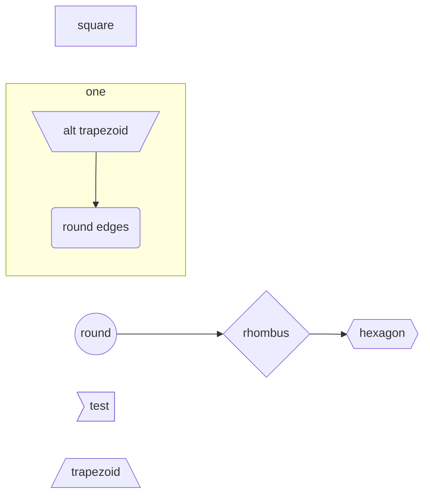

# Pre-defined variables and assumptions

The script needs at least two parameters to work properly:

  1. SRC\_DIR (mandatory) - Directory with the files that need checking, ie. files that should be merged into the existing target directory.
  2. TARGET\_DIR (mandatory) - This directory contains all the files are presumed to be sorted and that the user wants to copy new files to. 
  3. MD5\_DIR (optional), standard is /tmp - The script creates a checksum file for the source and the target folder. If no checksum folder is set everything will be stored in /tmp, making the storage unreliable for future checks.
  5. DEEP\_CHK (optional) - Performs a md5sum for every file in the TARGET\_DIR even if it is already in the checksum file.
  6. DEEP\_CLEAN (optional) - Performs a deep clean of the SRC\_DIR including files like .AppleDouble, .DsStore etc.
  7. ACCURATE (optional) - Perform a check that compares the checksum and the filename.
  8. VERBOSE (optional) - Print additional information during the run. Can be helpful for debugging or if the user wants to have a few more infos.
  9. PERMISSIVE (optional) - If set, the script will not ask to verify the configuration. Can be useful if the script is run from another script or as a cron job. 

## Sanity Check

The script first checks the configuration. If there is no configuration is set, then the script proceeds to ask the user for input. Optionally, the user can override any previous configuration by providing options and parameters when calling the script.

The initial check will throw errors if the MD5, SRC, and TARGET directories are the same or if any of the directories are not readable.

## Check existing files in the TARGET\_DIR

The script will then proceed to calculate all the md5 sums in the TARGET\_DIR first. If an older checksum file exists, new checksum will be appended to that file. The script will check if the filename exists--if DEEP\_CHK is set, it file calculate the md5 sum and compare those as well and report the change to the user.

## Clean and Compare the SRC\_DIR

After the calculations for the TARGET\_DIR are completed, the script will clean the SRC\_DIR from any empty directories and files. In addition, if DEEP\_CLEAN is set the script will also delete meta files like .DsStore or .AppleDouble. 

Then, the script will calculate the checksums for the SRC\_DIR and compare them to the checksums for the TARGET\_DIR. This check omits the file name because the MD5 checksum is more accurate and can also find files that are the same although they have different filenames. By enabling ACCURATE that behavior can be changed to check the checksum and filename in order to keep files that are identical but have different filenames.

If there is a match, the file will be deleted from the SRC\_DIR. After checking every file, the script will clean up any empty directories left in the SRC\_DIR.

## Final Report

Finally, if the script found any changes in the TARGET\_DIR while performing the update of the checksum file it will export a report.

The standard report will include the runtime of the script, number of files deleted, freed up space, and total number of files compared.

```mermaid
graph TD;
  start
  root[$Root_Dir]
  src[$Src_Dir]
  target[$Target_Dir]

  subgraph "LOOP root-variable"
    $root-->check4root{{is loop for setting root-variable?}}
    check4root-->|TRUE| rootexists
    check4root-->|FALSE| rootnone 
  end

  subgraph "LOOP set variable"


    subgraph "Check if config data is present"
      $confVar[variable set in config file]-->isset{{isset}}
      isset-->|TRUE| confirmConf(confirm the config with user)
      
      confirmConf-->|FALSE| ask4Folder
      isset-->|FALSE| ask4Folder(ask user for input)
    end

    subgraph "set variable to config value or user input"
      confirmConf-->|TRUE| setVariable
      ask4Folder-->setVariable

      setVariable-->checkIfRoot{{Is folder = $ROOT_DIR }}
      checkIfRoot-->|FALSE| check$Root{{Check if root variable is set}}

      checkIfRoot-->|TRUE| checkFolderDefinition


      
      checkFolderDefinition-->|root| folderFromRoot
      checkFolderDefinition-->|home| folderFromHome
      checkFolderDefinition-->|relative| settingPath


      folderFromRoot-->variableSetRoot($folder = input/config)
      folderFromHome-->variableSetHOME($folder = $HOME + input/config)

      subgraph "Setting PATH"
        settingPath-->check$Root
        check$Root-->|TRUE| PATHRoot[$PATH = $ROOT_DIR + input/config]
        check$Root-->|FALSE| PATHRelative[$PATH = $PWD + input/config]
      end


    end

  end


```

{{Check the definition of the folder}}
# examples

